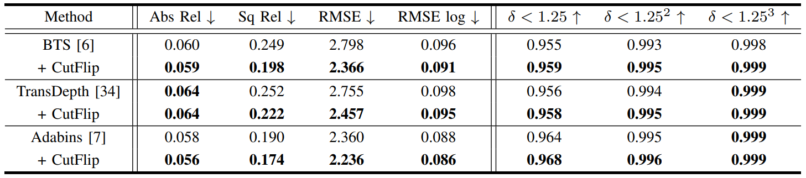

# URCDC-Depth: Uncertainty Rectified Cross-Distillation with CutFlip for Monocular Depth Estimation
[](https://paperswithcode.com/sota/monocular-depth-estimation-on-kitti-eigen?p=urcdc-depth-uncertainty-rectified-cross) 
[](https://paperswithcode.com/sota/monocular-depth-estimation-on-nyu-depth-v2?p=urcdc-depth-uncertainty-rectified-cross)

This is the official PyTorch implementation of the method described in

> **URCDC-Depth: Uncertainty Rectified Cross-Distillation with CutFlip for Monocular Depth Estimation** 

[[Link to paper]](https://arxiv.org/abs/2302.08149)
>
> [Shuwei Shao](https://scholar.google.com.hk/citations?hl=zh-CN&user=ecZHSVQAAAAJ), Zhongcai Pei, [Weihai Chen](https://scholar.google.com.hk/citations?hl=zh-CN&user=5PoZrcYAAAAJ), Ran Li, Zhong Liu and [Zhengguo Li](https://scholar.google.com.hk/citations?hl=zh-CN&user=LiUX7WQAAAAJ)
>

## Overview

We have released the code of CutFlip, which has been incorporated into the dataloader.py.  Apart from the results shown in the article, we apply the CutFip to different monocular depth estimation algorithms on the KITTI dataset, such as BTS, TransDepth and Adabins,

<p align="center">
 
</p>

We have released the complete code.

## ✏️ 📄 Citation

If you find our work useful in your research please consider citing our paper:

```
@article{shao2023urcdc,
  title={URCDC-Depth: Uncertainty Rectified Cross-Distillation with CutFlip for Monocular Depth Estimatione},
  author={Shao, Shuwei and Pei, Zhongcai and Chen, Weihai and Li, Ran and Liu, Zhong and Li, Zhengguo},
  journal={IEEE Transactions on Multimedia},
  year={2023},
}
```
## Contents
1. [Installation](#installation)
2. [Datasets](#datasets)
3. [Training](#training)
4. [Evaluation](#evaluation)
5. [Models](#models)

## Installation
```
conda create -n urcdc python=3.8
conda activate urcdc
conda install pytorch=1.10.0 torchvision cudatoolkit=11.1
pip install matplotlib, tqdm, tensorboardX, timm, mmcv
```


## Datasets
You can prepare the datasets KITTI and NYUv2 according to [here](https://github.com/cleinc/bts), and then modify the data path in the config files to your dataset locations.


## Training
First download the pretrained encoder backbone from [here](https://github.com/microsoft/Swin-Transformer), and then modify the pretrain path in the config files.

Training the NYUv2 model:
```
python urcdc/train.py configs/arguments_train_nyu.txt
```

Training the KITTI model:
```
python urcdc/train.py configs/arguments_train_kittieigen.txt
```


## Evaluation
Evaluate the NYUv2 model:
```
python urcdc/eval.py configs/arguments_eval_nyu.txt
```

Evaluate the KITTI model:
```
python urcdc/eval.py configs/arguments_eval_kittieigen.txt
```

## Models
| Model | Abs.Rel. | Sqr.Rel | RMSE | RMSElog | a1 | a2 | a3| 
| :--- | :---: | :---: | :---: |  :---: |  :---: |  :---: |  :---: |
|[NYUv2] (https://pan.baidu.com/s/12MoyBuGCi4fBDvXUMsdMsg) (code:urcd) | 0.088 | - | 0.316 | - | 0.933 | 0.992 | 0.998 |
|[KITTI_Eigen] (https://pan.baidu.com/s/12MoyBuGCi4fBDvXUMsdMsg) (code:urcd) | 0.050 | 0.142 | 2.032 | 0.076 | 0.977 | 0.997 | 0.999 

## Contact

If you have any questions, please feel free to contact swshao@buaa.edu.cn.


## Acknowledgement

Our code is based on the implementation of [BTS](https://github.com/cleinc/bts) and [NewCRFs](https://github.com/aliyun/NeWCRFs). We thank their excellent works.
